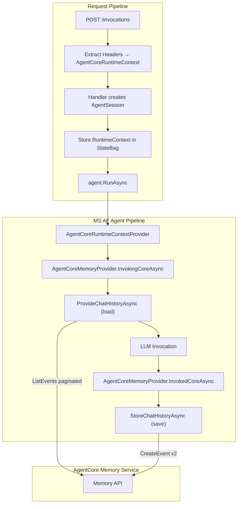
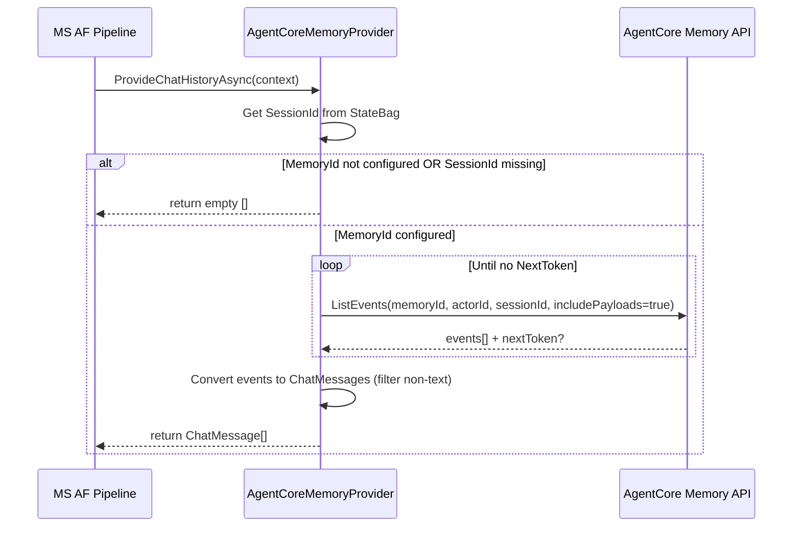
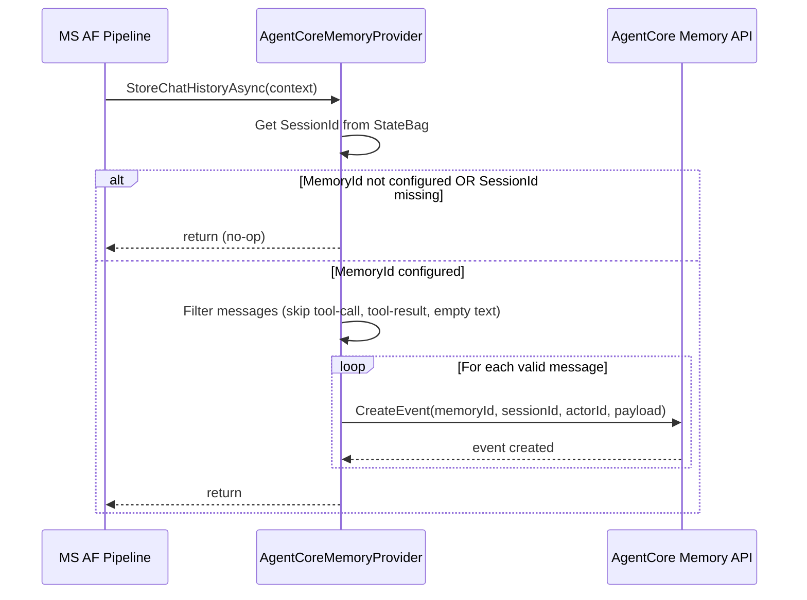

# Design Document: AgentCore Memory Integration

## Overview

This design integrates the Amazon Bedrock AgentCore Memory service into AWS.AgentCore as a `ChatHistoryProvider` within the Microsoft Agent Framework pipeline. The provider automatically loads conversation history before each agent run and saves new messages after, giving agents persistent multi-turn memory that survives container restarts and scaling events.

### Goals

1. Implement `AgentCoreMemoryProvider` as a `ChatHistoryProvider` that bridges AgentCore Memory APIs (ListEvents/CreateEvent) into the MS AF pipeline
2. Automatically register the provider via `AddAgentCore()` with zero additional user code
3. Gracefully degrade to pass-through mode when MemoryId is not configured
4. Filter tool-call/tool-result messages and empty-text messages from persistence
5. Handle pagination for long conversation histories
6. Maintain NativeAOT compatibility with source-generated JSON
7. Ensure concurrent request isolation via per-request session state (no shared mutable state)

### Non-Goals

- Conversation windowing or summarization (separate future feature)
- Long-term memory / semantic search (AgentCore Memory Records, separate feature)
- Custom branching strategies (use default branch)
- Exposing the Memory client directly to users (internal implementation detail)

## Architecture



### Data Flow: Load History



### Data Flow: Save Messages



## Components and Interfaces

### New Classes

#### `AgentCoreMemoryProvider` (public)

The core component — a `ChatHistoryProvider` that bridges AgentCore Memory into the MS AF pipeline.

```csharp
using Microsoft.Agents.AI;
using Microsoft.Extensions.AI;
using Microsoft.Extensions.Logging;
using Amazon.BedrockAgentCore;
using Amazon.BedrockAgentCore.Model;

namespace AWS.AgentCore;

/// <summary>
/// A <see cref="ChatHistoryProvider"/> that persists conversation history to
/// Amazon Bedrock AgentCore Memory. Loads history before each agent run via ListEvents
/// and saves new messages after via CreateEvent.
/// <para>
/// Registered automatically by <see cref="Extensions.AgentCoreBuilderExtensions.AddAgentCore"/>.
/// Operates in pass-through mode (no-op) when MemoryId is not configured.
/// </para>
/// </summary>
public sealed class AgentCoreMemoryProvider : ChatHistoryProvider
{
    private readonly IAmazonBedrockAgentCore? _memoryClient;
    private readonly AgentCoreOptions _options;
    private readonly ILogger<AgentCoreMemoryProvider> _logger;

    public AgentCoreMemoryProvider(
        AgentCoreOptions options,
        ILogger<AgentCoreMemoryProvider> logger,
        IAmazonBedrockAgentCore? memoryClient = null)
        : base(null, null)
    {
        _options = options;
        _logger = logger;
        _memoryClient = memoryClient;
    }

    public override string StateKey => "AgentCore.Memory";

    /// <summary>
    /// Resolves the effective MemoryId from options or environment variable.
    /// Options takes precedence over environment variable.
    /// </summary>
    private string? GetEffectiveMemoryId()
    {
        if (!string.IsNullOrWhiteSpace(_options.MemoryId))
            return _options.MemoryId;

        var envValue = Environment.GetEnvironmentVariable("MEMORY_ID");
        return string.IsNullOrWhiteSpace(envValue) ? null : envValue;
    }

    protected override async ValueTask<IEnumerable<ChatMessage>> ProvideChatHistoryAsync(
        InvokingContext context,
        CancellationToken cancellationToken = default)
    {
        var memoryId = GetEffectiveMemoryId();
        if (memoryId is null)
            return [];

        if (_memoryClient is null)
        {
            _logger.LogError("MemoryId is configured but IAmazonBedrockAgentCore is not registered in DI. Memory operations will be skipped.");
            return [];
        }

        var sessionId = GetSessionId(context.Session);
        if (sessionId is null)
        {
            _logger.LogWarning("SessionId not available in session StateBag. Skipping memory load.");
            return [];
        }

        try
        {
            return await LoadHistoryAsync(memoryId, sessionId, cancellationToken);
        }
        catch (Exception ex)
        {
            _logger.LogError(ex, "Failed to load conversation history from AgentCore Memory. Proceeding without history.");
            return [];
        }
    }

    protected override async ValueTask StoreChatHistoryAsync(
        InvokedContext context,
        CancellationToken cancellationToken = default)
    {
        var memoryId = GetEffectiveMemoryId();
        if (memoryId is null)
            return;

        if (_memoryClient is null)
            return;

        var sessionId = GetSessionId(context.Session);
        if (sessionId is null)
            return;

        var messagesToSave = FilterMessagesForStorage(
            context.RequestMessages, context.ResponseMessages);

        foreach (var (role, text) in messagesToSave)
        {
            try
            {
                await SaveEventAsync(memoryId, sessionId, role, text, cancellationToken);
            }
            catch (Exception ex)
            {
                _logger.LogError(ex, "Failed to save message to AgentCore Memory. Continuing.");
            }
        }
    }

    // ... private helper methods (see detailed design below)
}
```

#### Key Private Methods

```csharp
private string? GetSessionId(AgentSession session)
{
    // Retrieve AgentCoreRuntimeContext from the session StateBag
    if (session.TryGetProperty(AgentCoreRuntimeContextProvider.ContextKey, out var contextObj)
        && contextObj is AgentCoreRuntimeContext runtimeContext)
    {
        return runtimeContext.SessionId;
    }
    return null;
}

private async Task<IEnumerable<ChatMessage>> LoadHistoryAsync(
    string memoryId, string sessionId, CancellationToken cancellationToken)
{
    var messages = new List<ChatMessage>();
    string? nextToken = null;

    do
    {
        ListEventsResponse response;
        try
        {
            response = await _memoryClient!.ListEventsAsync(new ListEventsRequest
            {
                MemoryId = memoryId,
                ActorId = sessionId,
                SessionId = sessionId,
                IncludePayloads = true,
                NextToken = nextToken
            }, cancellationToken);
        }
        catch (Exception ex) when (nextToken is not null)
        {
            // Partial pagination failure — return what we have
            _logger.LogWarning(ex, "Error fetching page during pagination. Returning {Count} messages loaded so far.", messages.Count);
            break;
        }

        foreach (var evt in response.Events ?? [])
        {
            if (TryConvertEventToChatMessage(evt, out var chatMessage))
            {
                messages.Add(chatMessage);
            }
        }

        nextToken = response.NextToken;
    }
    while (!string.IsNullOrEmpty(nextToken));

    return messages;
}

private static bool TryConvertEventToChatMessage(Event evt, out ChatMessage message)
{
    message = default!;

    if (evt.Payload is null || evt.Payload.Count == 0)
        return false;

    // Find the first conversational payload with text content
    foreach (var payload in evt.Payload)
    {
        if (payload.Conversational is { } conversational
            && conversational.Content?.Text is { Length: > 0 } text)
        {
            var role = conversational.Role switch
            {
                ConversationRole.USER => ChatRole.User,
                ConversationRole.ASSISTANT => ChatRole.Assistant,
                _ => (ChatRole?)null
            };

            if (role is not null)
            {
                message = new ChatMessage(role.Value, text);
                return true;
            }
        }
    }

    return false;
}

private async Task SaveEventAsync(
    string memoryId, string sessionId, ConversationRole role, string text,
    CancellationToken cancellationToken)
{
    await _memoryClient!.CreateEventAsync(new CreateEventRequest
    {
        MemoryId = memoryId,
        SessionId = sessionId,
        ActorId = sessionId,
        EventTimestamp = DateTime.UtcNow,
        Payload = new List<PayloadType>
        {
            new PayloadType
            {
                Conversational = new Conversational
                {
                    Role = role,
                    Content = new Content { Text = text }
                }
            }
        }
    }, cancellationToken);
}

private static IEnumerable<(ConversationRole Role, string Text)> FilterMessagesForStorage(
    IEnumerable<ChatMessage>? requestMessages,
    IEnumerable<ChatMessage>? responseMessages)
{
    var allMessages = (requestMessages ?? []).Concat(responseMessages ?? []);

    foreach (var message in allMessages)
    {
        // Skip messages with tool-call or tool-result content
        if (HasToolContent(message))
            continue;

        // Extract text content
        var text = message.Text;
        if (string.IsNullOrWhiteSpace(text))
            continue;

        // Map role
        var role = message.Role == ChatRole.User
            ? ConversationRole.USER
            : ConversationRole.ASSISTANT;

        yield return (role, text);
    }
}

private static bool HasToolContent(ChatMessage message)
{
    if (message.Contents is null)
        return false;

    foreach (var content in message.Contents)
    {
        if (content is FunctionCallContent or FunctionResultContent)
            return true;
    }

    return false;
}
```

### Modified Classes

#### `AgentCoreOptions` (modified)

```csharp
public class AgentCoreOptions
{
    // ... existing properties ...

    /// <summary>
    /// The AgentCore Memory ID for persistent conversation history.
    /// When set, the Memory provider actively loads and saves conversation history.
    /// Falls back to the <c>MEMORY_ID</c> environment variable when not set.
    /// </summary>
    public string? MemoryId { get; set; }
}
```

#### `AgentCoreBuilderExtensions.AddAgentCore()` (modified)

Added registrations for the Memory provider and the AWS SDK client:

```csharp
public static WebApplicationBuilder AddAgentCore(this WebApplicationBuilder builder, Action<AgentCoreOptions>? configure = null)
{
    // ... existing registrations ...

    // Register IAmazonBedrockAgentCore for Memory operations (optional — TryAdd so it doesn't fail if not needed)
    builder.Services.TryAddAWSService<IAmazonBedrockAgentCore>();

    // Register AgentCoreMemoryProvider
    builder.Services.AddSingleton<AgentCoreMemoryProvider>();

    // Wire the Memory provider into the agent's AIContextProviders list
    // (done inside the AIAgent factory, after AgentCoreRuntimeContextProvider)

    return builder;
}
```

The `AIAgent` factory is updated to attach both context providers to the agent options:

```csharp
builder.Services.AddSingleton<AIAgent>(sp =>
{
    // ... existing IChatClient resolution ...

    var agentOptions = options.AgentOptions ?? new ChatClientAgentOptions();

    // Attach context providers: RuntimeContext first, then Memory
    var runtimeContextProvider = sp.GetRequiredService<AgentCoreRuntimeContextProvider>();
    var memoryProvider = sp.GetRequiredService<AgentCoreMemoryProvider>();

    var providers = new List<AIContextProvider>();
    providers.Add(runtimeContextProvider);
    providers.Add(memoryProvider);

    // Preserve any user-registered providers
    if (agentOptions.AIContextProviders is not null)
        providers.AddRange(agentOptions.AIContextProviders);

    agentOptions.AIContextProviders = providers;
    // Also set ChatHistoryProvider specifically
    agentOptions.ChatHistoryProvider = memoryProvider;

    var agent = new ChatClientAgent(chatClient, agentOptions);

    if (options.ConfigureAgent is not null)
        return options.ConfigureAgent(agent);

    return agent;
});
```

### AWS SDK Package

The .NET SDK package for AgentCore is **`AWSSDK.BedrockAgentCore`**. This follows the standard AWS SDK for .NET naming convention where the service name maps directly to the NuGet package name. The Java SDK uses `software.amazon.awssdk:bedrockagentcore`, and the .NET SDK follows the pattern `AWSSDK.{ServiceName}`.

The service client interface is `IAmazonBedrockAgentCore` in the `Amazon.BedrockAgentCore` namespace, with model types in `Amazon.BedrockAgentCore.Model`.

**Package reference to add to `AWS.AgentCore.csproj`:**

```xml
<PackageReference Include="AWSSDK.BedrockAgentCore" Version="4.0.*" />
```

### DI Registration Summary

| Service                           | Lifetime  | Condition                                                      |
| --------------------------------- | --------- | -------------------------------------------------------------- |
| `AgentCoreOptions`                | Singleton | Always                                                         |
| `IAmazonBedrockAgentCore`         | Singleton | TryAdd (doesn't fail if already registered or not needed)      |
| `AgentCoreRuntimeContextProvider` | Singleton | Always                                                         |
| `AgentCoreMemoryProvider`         | Singleton | Always (operates in pass-through when MemoryId not configured) |
| `AIAgent` / `ChatClientAgent`     | Singleton | Always                                                         |

### Session State Flow

```
HTTP Header: X-Amzn-Bedrock-AgentCore-Runtime-Session-Id
    ↓
AgentCoreRuntimeContext.SessionId (extracted in MapAgentCore pipeline)
    ↓
Handler stores context in session StateBag via AgentCoreSessionFactory
    ↓
AgentCoreMemoryProvider reads SessionId from StateBag
    ↓
Uses SessionId as both sessionId and actorId for Memory API calls
```

## Data Models

### AgentCore Memory API Types (from AWS SDK)

| Type                  | Description                                                                                     |
| --------------------- | ----------------------------------------------------------------------------------------------- |
| `ListEventsRequest`   | Request: memoryId (URI), actorId (URI), sessionId (URI), includePayloads, maxResults, nextToken |
| `ListEventsResponse`  | Response: events[], nextToken                                                                   |
| `Event`               | eventId, actorId, sessionId, memoryId, eventTimestamp, payload[], metadata                      |
| `CreateEventRequest`  | Request: memoryId (URI), actorId, sessionId, eventTimestamp, payload[]                          |
| `CreateEventResponse` | Response: event                                                                                 |
| `PayloadType`         | Union: conversational OR blob                                                                   |
| `Conversational`      | role (USER, ASSISTANT, TOOL, OTHER), content                                                    |
| `Content`             | Union: text (string, min 1, max 100000)                                                         |

### Role Mapping

| AgentCore Memory Role | MS AF ChatRole       | Direction                       |
| --------------------- | -------------------- | ------------------------------- |
| `USER`                | `ChatRole.User`      | Load & Save                     |
| `ASSISTANT`           | `ChatRole.Assistant` | Load & Save                     |
| `TOOL`                | —                    | Skipped (not loaded, not saved) |
| `OTHER`               | —                    | Skipped (not loaded, not saved) |

### Message Filtering Rules (Save)

A message is persisted to Memory only if ALL of the following are true:

1. The message role is User or Assistant
2. The message does NOT contain `FunctionCallContent` or `FunctionResultContent`
3. The message's text content (`message.Text`) is not null/empty/whitespace
4. The text length is ≥ 1 character (Memory API constraint)

## Correctness Properties

_A property is a characteristic or behavior that should hold true across all valid executions of a system — essentially, a formal statement about what the system should do. Properties serve as the bridge between human-readable specifications and machine-verifiable correctness guarantees._

### Property 1: Event-to-ChatMessage Conversion Preserves Data

_For any_ valid AgentCore Memory event with a conversational payload containing a USER or ASSISTANT role and non-empty text content, converting it to a ChatMessage and examining the result should yield a ChatMessage with the corresponding ChatRole and identical text content.

**Validates: Requirements 1.2, 3.3**

### Property 2: Message Filtering Excludes Invalid Messages

_For any_ ChatMessage, the message should be persisted to Memory if and only if: (a) it has User or Assistant role, (b) it contains no FunctionCallContent or FunctionResultContent, and (c) its text content is non-null and non-whitespace with length ≥ 1.

**Validates: Requirements 2.3, 3.1, 3.2, 3.4**

### Property 3: Pagination Fetches All Pages in Order

_For any_ sequence of N paginated ListEvents responses (where responses 1..N-1 have a NextToken and response N does not), the provider should make exactly N API calls and return all events concatenated in the order they were received (page 1 events, then page 2 events, etc.).

**Validates: Requirements 1.3, 10.1, 10.2**

### Property 4: Errors Never Propagate to Caller

_For any_ exception thrown by the AgentCore Memory client during either ListEvents or CreateEvent, the provider should catch the exception, log it, and return gracefully (empty collection for load, no-throw for save) — never allowing the exception to propagate to the agent pipeline.

**Validates: Requirements 1.5, 2.4**

### Property 5: Concurrent Session Isolation

_For any_ two concurrent invocations with different SessionIds, the Memory operations for each invocation should use only its own SessionId — ListEvents and CreateEvent calls for invocation A should never use invocation B's SessionId, and vice versa.

**Validates: Requirements 6.2, 8.1, 8.2, 8.4**

### Property 6: Partial Pagination Failure Returns Loaded Pages

_For any_ pagination sequence where an error occurs on page K (where K > 1), the provider should return all events successfully loaded from pages 1 through K-1, log a warning, and not throw.

**Validates: Requirements 10.3**

## Error Handling

### Error Strategy: Log and Continue

The Memory provider follows a strict "log and continue" policy. Memory is an enhancement — it must never cause an agent invocation to fail.

| Scenario                                                    | Behavior                                                              |
| ----------------------------------------------------------- | --------------------------------------------------------------------- |
| ListEvents throws any exception                             | Log error, return empty history, agent proceeds without context       |
| CreateEvent throws any exception                            | Log error, skip that message, continue saving remaining messages      |
| Pagination error on page K > 1                              | Log warning, return pages 1..K-1, agent proceeds with partial history |
| SessionId not in StateBag                                   | Log warning, return empty / skip save                                 |
| IAmazonBedrockAgentCore not in DI (but MemoryId configured) | Log error once, operate in pass-through mode                          |
| MemoryId not configured                                     | No logging, no API calls, pure pass-through                           |

### Error Logging Levels

- `LogError` — Memory client threw an exception, or client not available when MemoryId is configured
- `LogWarning` — SessionId missing from StateBag, partial pagination failure
- No logging — MemoryId not configured (this is normal operation, not an error)

### Retry Strategy

The provider does NOT implement retries. The AWS SDK client handles retries internally via its configured retry policy. If the SDK exhausts retries and throws, the provider catches and logs.

## Testing Strategy

### Property-Based Testing

This feature is suitable for property-based testing because:

- The core logic involves data transformation (events ↔ ChatMessages) with a large input space
- Message filtering has universal properties that should hold across all message types
- Pagination logic has properties that hold regardless of page count
- Error handling has a universal property (never propagate)

**Library:** [FsCheck](https://fscheck.github.io/FsCheck/) via `FsCheck.Xunit` (standard .NET PBT library)

**Configuration:** Minimum 100 iterations per property test.

**Tag format:** `Feature: agentcore-memory, Property {number}: {property_text}`

### Unit Tests

| Test                                                        | What It Verifies              |
| ----------------------------------------------------------- | ----------------------------- |
| `ProvideChatHistory_NoMemoryId_ReturnsEmpty`                | Pass-through mode             |
| `ProvideChatHistory_NoSessionId_ReturnsEmptyAndLogsWarning` | Missing session handling      |
| `ProvideChatHistory_NoMemoryClient_LogsErrorReturnsEmpty`   | Missing SDK client            |
| `StoreChatHistory_NoMemoryId_DoesNothing`                   | Pass-through mode for save    |
| `StoreChatHistory_SkipsToolCallMessages`                    | Tool-call filtering           |
| `StoreChatHistory_SkipsToolResultMessages`                  | Tool-result filtering         |
| `StoreChatHistory_SkipsEmptyTextMessages`                   | Empty text filtering          |
| `StoreChatHistory_SavesUserAndAssistantMessages`            | Happy path save               |
| `StoreChatHistory_UsesSessionIdAsActorId`                   | ActorId mapping               |
| `GetEffectiveMemoryId_OptionsOverridesEnvVar`               | Configuration precedence      |
| `GetEffectiveMemoryId_FallsBackToEnvVar`                    | Environment variable fallback |
| `AddAgentCore_RegistersMemoryProvider`                      | DI registration               |
| `AddAgentCore_MemoryProviderAfterRuntimeContextProvider`    | Provider ordering             |
| `AddAgentCore_PreservesUserContextProviders`                | Non-interference              |

### Integration Tests

| Test                                                 | What It Verifies                            |
| ---------------------------------------------------- | ------------------------------------------- |
| `MemoryProvider_LoadsAndSavesHistory_EndToEnd`       | Full round-trip with real/mocked Memory API |
| `MemoryProvider_ConcurrentRequests_Isolated`         | Session isolation under concurrency         |
| `MemoryProvider_NativeAot_NoTrimmingWarnings`        | AOT compatibility                           |
| `MemoryProvider_SourceGenerator_RegisteredCorrectly` | Source generator DX path                    |

### Property Tests (from Correctness Properties)

| Test                                            | Property   |
| ----------------------------------------------- | ---------- |
| `EventToMessageConversion_PreservesRoleAndText` | Property 1 |
| `MessageFiltering_OnlyPersistsValidMessages`    | Property 2 |
| `Pagination_FetchesAllPagesInOrder`             | Property 3 |
| `Errors_NeverPropagate`                         | Property 4 |
| `ConcurrentSessions_UseCorrectSessionId`        | Property 5 |
| `PartialPaginationFailure_ReturnsLoadedPages`   | Property 6 |
