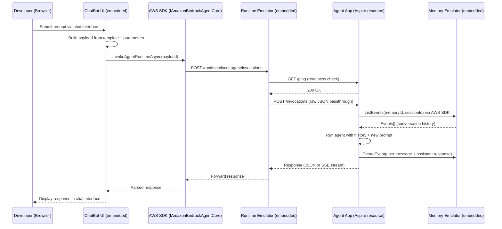

# Design Document: Aspire Local Development Experience

## Overview

This design provides a .NET Aspire-based local development experience for the AWS.AgentCore library. The solution uses a single self-contained NuGet package (`AWS.AgentCore.Testing`) that embeds all emulator logic and a ChatBot UI directly within the package. All emulators run as in-process Kestrel servers within the AppHost — no Docker, no separate processes. The developer presses F5/Run on the AppHost and the entire stack starts — agent app with embedded runtime emulator, memory emulator, and ChatBot UI — with zero AWS credentials required for the core loop.

The `AddAgentCoreRuntime<TProject>()` extension returns `IResourceBuilder<ProjectResource>`, making it fully compatible with Aspire's deployment features (`PublishAs*`) and the standard `WithReference()` pattern. A custom `WithReference` overload detects the `AgentCoreRuntimeAnnotation` and injects the `AGENTCORE_SERVICE_ENDPOINT` environment variable, allowing consuming apps to override the AWS SDK's `ServiceURL` to point at the local runtime emulator.

### Goals

1. Provide a single-action (F5/Run) local development experience via .NET Aspire orchestration
2. Implement an embedded Runtime Emulator that exposes the SDK-compatible `/runtimes/{arn}/invocations` endpoint
3. Implement an embedded Memory Emulator that serves ListEvents/CreateEvent in-memory
4. Provide a ChatBot UI with configurable payload editor, dynamic parameters, and modern dark/light theme
5. Require zero AWS credentials for the core development loop (Memory + Runtime emulation)
6. Return `IResourceBuilder<ProjectResource>` for Aspire deployment compatibility
7. Support `WithReference(agent)` to inject the runtime emulator endpoint into consuming projects
8. Support both standard JSON and SSE streaming response modes
9. Pipe emulator logs to Aspire Dashboard via `ResourceLoggerService`

### Non-Goals

- Production deployment orchestration (Aspire is for local dev only in this context)
- Full AWS service emulation beyond Memory (e.g., no Bedrock LLM emulation)
- NativeAOT support for the emulators (they are dev-time tools only)
- Persistent storage for the Memory Emulator (in-memory only, resets on restart)

## Architecture

```mermaid
graph TD
    subgraph "Aspire AppHost Process"
        AH[AppHost Program.cs]
        RE[Runtime Emulator<br/>Embedded Kestrel Server<br/>POST /runtimes/{arn}/invocations]
        ME[Memory Emulator<br/>Embedded Kestrel Server]
        UI[ChatBot UI<br/>Embedded Blazor Server]
    end

    subgraph "Aspire Managed Resources"
        AA[Agent App<br/>POST /invocations<br/>GET /ping]
        WA[Web App (ChatBotUI)<br/>reads AGENTCORE_SERVICE_ENDPOINT]
    end

    subgraph "Aspire Infrastructure"
        DB[Aspire Dashboard]
    end

    AH -->|"AddAgentCoreRuntime&lt;T&gt;()"| AA
    AH -->|"AfterResourcesCreatedEvent"| RE
    AH -->|"AfterResourcesCreatedEvent"| ME
    AH -->|"AfterResourcesCreatedEvent"| UI
    AH -->|"WithReference(agent)"| WA

    UI -->|"InvokeAgentRuntime<br/>via AWS SDK"| RE
    WA -->|"InvokeAgentRuntime<br/>via AWS SDK"| RE
    RE -->|"POST /invocations<br/>GET /ping"| AA
    AA -->|"ListEvents / CreateEvent<br/>via AWS SDK"| ME

    AA -.->|"logs"| DB
    RE -.->|"logs via AspireLoggerProvider"| DB
```

### Request Flow: Developer Submits a Prompt



## Components and Interfaces

### Project Structure

```
src/AWS.AgentCore.Testing/              # Self-contained NuGet package
├── AgentCoreTestingExtensions.cs       # AddAgentCoreRuntime<T>(), WithStreaming(), WithInMemory(), WithReference()
├── AgentCoreRuntimeBuilder.cs          # (empty - kept for backward compat)
├── RuntimeEmulatorServer.cs            # Creates embedded runtime Kestrel server
├── MemoryEmulatorServer.cs             # Creates embedded memory Kestrel server
├── ChatAppServer.cs                    # Creates embedded Blazor Server app
├── Services/
│   ├── PortAllocator.cs                # TCP port pre-allocation
│   └── AspireLoggerProvider.cs         # Bridges embedded server logs to Aspire Dashboard
├── Emulators/
│   ├── Runtime/
│   │   ├── RuntimeEmulatorService.cs   # Request forwarding logic (raw passthrough)
│   │   └── Models/                     # PromptSubmission, InvocationResult
│   └── Memory/
│       ├── InMemoryEventStore.cs       # In-memory event storage
│       └── Models/                     # CreateEventApiRequest, EventModel, etc.
├── Components/                         # Blazor ChatBot UI
│   ├── App.razor, Routes.razor
│   ├── CodeEditor.razor + .razor.js    # Custom code editor component
│   ├── Layout/                         # MainLayout, Sidebar, ReconnectModal
│   └── Pages/                          # Home (chat + payload editor)
├── Services/                           # AgentCoreService, ChatSessionManager
├── Models/                             # AgentCoreSettings, ChatMessage, ChatSession
├── wwwroot/                            # Static assets (app.css, aws.svg, aws-light.svg)
├── build/                              # NuGet .targets for wwwroot propagation
├── Program.cs                          # Required by Web SDK (not used as entry point)
└── README.md

sampleapps/
├── AspireAppHost/                      # Sample Aspire AppHost
├── ChatBotUI/                          # Standalone web app (reads AGENTCORE_SERVICE_ENDPOINT)
├── RemoteMcpAgent/                     # MCP tool integration sample
├── MicrosoftAgentFrameworkSample/      # MS Agent Framework with middleware
├── AnnotationsSample/                  # Annotation-based agent
├── AnnotationsStreamingAgent/          # Streaming agent
└── ...

test/
├── AWS.AgentCore.UnitTests/
├── AWS.AgentCore.Testing.UnitTests/
├── AWS.AgentCore.Testing.IntegrationTests/  # References AspireAppHost project
└── AWS.AgentCore.SourceGenerator.UnitTests/
```

### Key Components

#### 1. AgentCoreTestingExtensions

The primary entry point. Returns `IResourceBuilder<ProjectResource>` for deployment compatibility.

```csharp
// Register an agent with runtime emulator + chat app
public static IResourceBuilder<ProjectResource> AddAgentCoreRuntime<TProject>(
    this IDistributedApplicationBuilder builder, string? name = null)

// Chain streaming mode
public static IResourceBuilder<ProjectResource> WithStreaming(
    this IResourceBuilder<ProjectResource> agentApp)

// Chain memory emulator
public static IResourceBuilder<ProjectResource> WithInMemory(
    this IResourceBuilder<ProjectResource> agentApp)

// Wire a consuming project to the runtime emulator
public static IResourceBuilder<ProjectResource> WithReference(
    this IResourceBuilder<ProjectResource> project,
    IResourceBuilder<ProjectResource> agent)
```

The `WithReference` overload detects `AgentCoreRuntimeAnnotation` on the agent resource and injects `AGENTCORE_SERVICE_ENDPOINT=http://localhost:{runtimePort}`.

#### 2. RuntimeEmulatorServer

Embedded Kestrel server exposing the SDK-compatible endpoint:

- `POST /runtimes/{agentRuntimeArn}/invocations` — receives SDK requests, forwards raw payload to agent
- `POST /api/prompt` — developer-friendly endpoint
- `GET /api/sessions` — session introspection
- `GET /health` — readiness check

Accepts an optional `ILoggerProvider` to pipe logs to Aspire Dashboard.

#### 3. RuntimeEmulatorService

Request forwarding logic:
- Passes `submission.Text` as raw `StringContent` (no wrapping in `{"prompt":"..."}`)
- Adds `X-Amzn-Bedrock-AgentCore-Runtime-Session-Id` and `X-Amzn-Bedrock-AgentCore-Runtime-Request-Id` headers
- Pings agent for readiness with exponential backoff
- Handles both JSON and SSE streaming responses

#### 4. ChatBot UI (ChatAppServer)

Embedded Blazor Server application with:
- Configurable JSON payload editor with `{{paramName}}` placeholders
- Dynamic parameters (string, number, boolean, raw JSON) that render as input fields
- Built-in payload templates
- Code editor component with line numbers, auto-indent, bracket matching
- Light/dark theme with cookie-based persistence
- AWS logo branding (theme-aware)
- Live payload preview
- Session management (create, switch, delete)
- Streaming support with stop button
- Copy response, markdown rendering

#### 5. AgentCoreRuntimeAnnotation

Internal annotation attached to the project resource:

```csharp
internal class AgentCoreRuntimeAnnotation(int runtimePort, int chatAppPort) : IResourceAnnotation
{
    public int RuntimePort { get; }
    public int ChatAppPort { get; }
    public bool IsStreaming { get; set; }
}
```

#### 6. AspireLoggerProvider

Bridges embedded server logging to Aspire's `ResourceLoggerService`:

```csharp
internal sealed class AspireLoggerProvider(ILogger aspireLogger) : ILoggerProvider
```

### Configuration / Environment Variables

| Variable                         | Set On         | Value                     | Purpose                                               |
| -------------------------------- | -------------- | ------------------------- | ----------------------------------------------------- |
| `AGENTCORE_ASPIRE_MANAGED`       | Agent App      | `"true"`                  | Tells AddAgentCore() to skip port 8080 binding        |
| `AWS_AGENTCORE_MEMORY_ID`        | Agent App      | `"localdev-memory"`       | Activates AgentCoreMemoryProvider                     |
| `AWS_AGENTCORE_SERVICE_ENDPOINT` | Agent App      | `http://localhost:{port}` | Redirects SDK to embedded memory emulator             |
| `AGENTCORE_SERVICE_ENDPOINT`     | Consumer App   | `http://localhost:{port}` | Injected by WithReference — runtime emulator endpoint |

### NuGet Package Structure

The `AWS.AgentCore.Testing` package includes:
- `lib/net10.0/` — DLL + runtimeconfig
- `content/wwwroot/` — Static assets (app.css, AWS logos, scoped CSS, blazor.web.js, collocated JS)
- `build/AWS.AgentCore.Testing.targets` — Copies wwwroot to consumer's output
- `buildTransitive/AWS.AgentCore.Testing.targets` — Same for transitive consumers
- `staticwebassets/` — SDK-managed static web assets

### ChatBotUI Sample App Integration

The standalone `ChatBotUI` sample demonstrates how any web app can consume an agent:

```csharp
// In Aspire AppHost:
var agent = builder.AddAgentCoreRuntime<Projects.MyAgent>().WithInMemory();
builder.AddProject<Projects.ChatBotUI>("chat-ui").WithReference(agent);

// In ChatBotUI/Program.cs:
var serviceEndpoint = builder.Configuration["AGENTCORE_SERVICE_ENDPOINT"];
if (!string.IsNullOrEmpty(serviceEndpoint))
{
    // Override SDK's ServiceURL to point at runtime emulator
    return new AmazonBedrockAgentCoreClient(new AmazonBedrockAgentCoreConfig
    {
        ServiceURL = serviceEndpoint,
        AuthenticationRegion = settings.Region
    });
}
```

### Remote MCP Tool Integration (RemoteMcpAgent)

The `RemoteMcpAgent` sample demonstrates connecting to remote MCP servers:

```csharp
// In Agent.cs [AgentCoreHandler]:
await mcpToolProvider.EnsureConnectedAsync(cancellationToken);
var runOptions = new ChatClientAgentRunOptions
{
    ChatOptions = new ChatOptions { Tools = [..mcpToolProvider.Tools] }
};
var response = await chatAgent.RunAsync(prompt, session: session, options: runOptions, ...);
```

`McpToolProvider` lazily connects via `HttpClientTransport` and caches `McpClientTool` instances.

## Data Models

### Runtime Emulator Models

```csharp
/// <summary>A request to invoke the agent with a JSON payload.</summary>
public record PromptSubmission(string Text, string? SessionId = null);

/// <summary>Result returned after invoking the agent.</summary>
public record InvocationResult(string SessionId, string RequestId, string Response, bool IsStreaming, DateTime Timestamp);

/// <summary>Tracks an active session.</summary>
public record SessionState(string SessionId, DateTime CreatedAt, DateTime LastActivityAt, int InvocationCount);

/// <summary>Raw SSE stream passthrough result.</summary>
public record StreamThroughResult(string SessionId, Stream ResponseStream);
```

### Memory Emulator Models

```csharp
public class CreateEventApiRequest
{
    public string ActorId { get; set; }
    public string SessionId { get; set; }
    public double? EventTimestamp { get; set; }  // Unix epoch seconds
    public List<PayloadTypeModel> Payload { get; set; }
}

public class ListEventsApiResponse
{
    public List<EventModel> Events { get; set; }
    public string? NextToken { get; set; }
}

public class EventModel
{
    public string EventId { get; set; }
    public string MemoryId { get; set; }
    public string ActorId { get; set; }
    public string SessionId { get; set; }
    public double EventTimestamp { get; set; }  // Unix epoch seconds
    public List<PayloadTypeModel>? Payload { get; set; }
}

public class PayloadTypeModel { public ConversationalModel? Conversational { get; set; } }
public class ConversationalModel { public string Role { get; set; } public ContentModel? Content { get; set; } }
public class ContentModel { public string? Text { get; set; } }
```

### Chat UI Models

```csharp
public class AgentCoreSettings { public string RuntimeArn { get; set; } public bool UseStreaming { get; set; } }
public class ChatSession { public string Id { get; set; } public string Title { get; set; } public List<ChatMessage> Messages { get; set; } }
public class ChatMessage { public string Id { get; set; } public ChatRole Role { get; set; } public string Content { get; set; } public DateTime Timestamp { get; set; } }
public enum ChatRole { User, Assistant }
```

## Correctness Properties

### Property 1: Memory Store Round-Trip

_For any_ valid conversation event, storing via CreateEvent and retrieving via ListEvents with the same MemoryId/SessionId/ActorId returns identical role, text, and timestamp.

### Property 2: Memory Store Chronological Ordering

_For any_ set of N events with distinct timestamps stored in arbitrary order, ListEvents returns them sorted ascending by EventTimestamp.

### Property 3: Memory Store Pagination Completeness

_For any_ set of N events exceeding page size, iterating all pages via NextToken yields exactly N events with no duplicates or gaps.

### Property 4: Memory Store Filtering Isolation

_For any_ two distinct (MemoryId, SessionId, ActorId) tuples, ListEvents for one never returns events belonging to the other.

### Property 5: IncludePayloads Controls Response Content

_For any_ stored events, ListEvents with `includePayloads=true` returns payloads; with `includePayloads=false` returns null payloads — same event count and IDs in both cases.

### Property 6: Runtime Emulator Raw Payload Passthrough

_For any_ JSON payload submitted via the SDK endpoint, the Runtime Emulator forwards the exact payload bytes to the agent's `/invocations` endpoint without modification.

### Property 7: Runtime Emulator Request-Id Uniqueness

_For any_ sequence of N invocations, all `X-Amzn-Bedrock-AgentCore-Runtime-Request-Id` values are unique.

### Property 8: Runtime Emulator Session Management

_For any_ submission with a provided SessionId, it is used verbatim; with null SessionId, a new valid UUID is generated.

## Error Handling

### Runtime Emulator

| Scenario                            | Behavior                                                  |
| ----------------------------------- | --------------------------------------------------------- |
| Agent not ready (ping fails)        | Retries with exponential backoff up to 30 seconds         |
| Agent returns HTTP 4xx/5xx          | Passes error response through to the caller               |
| Agent connection refused            | Throws TimeoutException after max retries                 |
| SSE stream interrupted              | Partial response returned; stream closed                  |
| Unmatched route                     | Returns 404 with diagnostic message via MapFallback       |

### Memory Emulator

| Scenario                     | Behavior                                    |
| ---------------------------- | ------------------------------------------- |
| Invalid CreateEvent body     | Returns 400 Bad Request                     |
| Invalid NextToken            | Returns 400 Bad Request                     |
| MemoryId not found           | Returns empty event list (not an error)     |
| Concurrent writes            | Thread-safe via ConcurrentDictionary + lock |

### Chat App

| Scenario                     | Behavior                                            |
| ---------------------------- | --------------------------------------------------- |
| Agent invocation fails       | Displays error message in chat bubble               |
| Request cancelled by user    | Displays "*Request cancelled.*" message             |
| Invalid payload template     | Falls back to `{"prompt":"..."}` with error banner  |
| Static assets not found      | PhysicalFileProvider serves from wwwroot             |

## Testing Strategy

### Unit Tests (test/AWS.AgentCore.Testing.UnitTests/)

- InMemoryEventStore: CRUD, filtering, pagination, ordering
- RuntimeEmulatorService: request formatting, session management, raw payload passthrough
- AgentCoreTestingExtensions: env vars, port allocation, resource registration
- Property-based tests (FsCheck): round-trip, ordering, pagination completeness, filtering isolation

### Integration Tests (test/AWS.AgentCore.Testing.IntegrationTests/)

- References `sampleapps/AspireAppHost` via `DistributedApplicationTestingBuilder.CreateAsync<Projects.AspireAppHost>()`
- Tests: ping endpoint, invocations endpoint, response format
- Requires AWS credentials for Bedrock LLM calls
