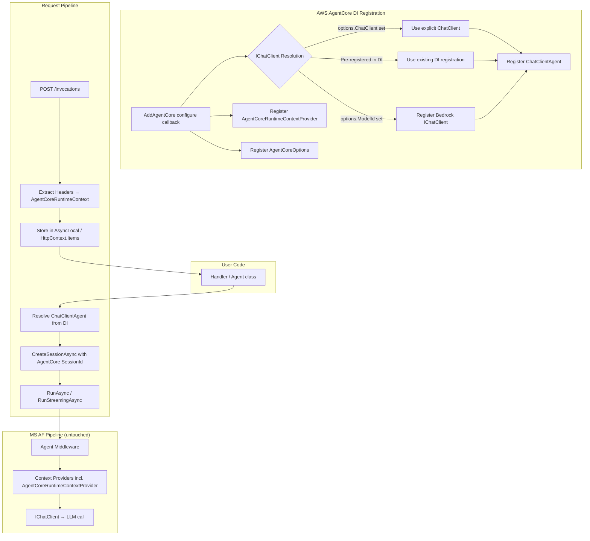
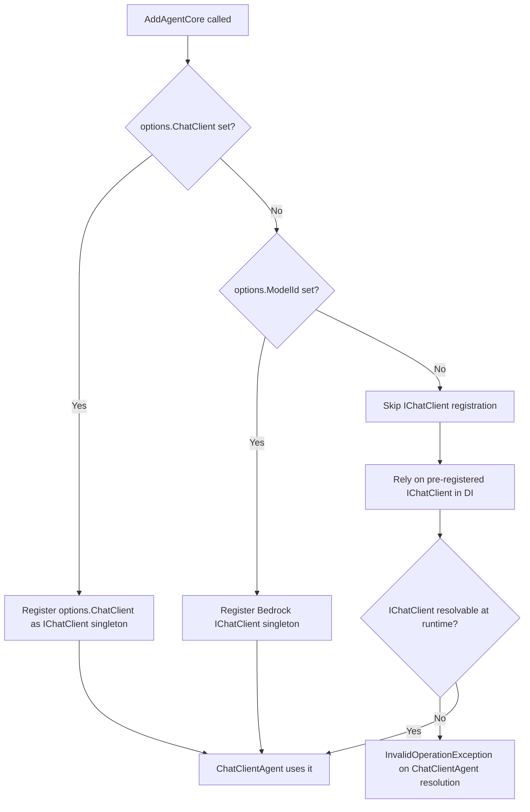

# Design Document: Microsoft Agent Framework Integration

## Overview

This design integrates Microsoft Agent Framework (MS AF) 1.0 deeply into AWS.AgentCore so that `AddAgentCore()` registers a fully-configured `ChatClientAgent` in DI, bridges AgentCore runtime context (session IDs, headers) into the MS AF pipeline, and makes the Bedrock model provider optional. The integration follows a thin-layer philosophy: AWS.AgentCore provides the deployment layer and Bedrock as a convenient default, while users configure their agents through standard MS AF patterns (`ChatClientAgentOptions`, `AsBuilder().Use()`, `AIContextProvider`).

### Goals

1. Register `ChatClientAgent` in DI with proper IChatClient resolution (three paths: `options.ChatClient`, pre-registered DI, `options.ModelId` Bedrock fallback)
2. Bridge AgentCore session IDs from HTTP headers into MS AF `AgentSession`
3. Expose `AgentCoreRuntimeContext` as an `AIContextProvider` so middleware/context providers can access AgentCore-specific data
4. Support standard MS AF configuration patterns without wrapping
5. Maintain full backward compatibility with existing code
6. Work with both source generator and extension method approaches
7. Maintain NativeAOT compatibility

### Non-Goals

- Wrapping MS AF features (MCP, A2A, workflows) behind AWS.AgentCore abstractions
- Implementing AgentCore Memory integration (separate feature)
- Implementing OpenTelemetry setup (separate feature)
- Creating a convenience `MapAgentCore` overload that auto-runs the agent (users write explicit `RunAsync`/`RunStreamingAsync` calls)

## Architecture



### IChatClient Resolution Priority



## Components and Interfaces

### Modified Classes

#### `AgentCoreOptions` (modified)

```csharp
public class AgentCoreOptions
{
    /// <summary>
    /// The Bedrock model ID. When set (and ChatClient is null), registers a Bedrock-backed IChatClient.
    /// No longer mandatory — users can provide their own IChatClient.
    /// </summary>
    public string? ModelId { get; set; }

    /// <summary>
    /// The port to listen on. AgentCore Runtime expects 8080. Default: 8080.
    /// </summary>
    public int Port { get; set; } = 8080;

    /// <summary>
    /// An explicit IChatClient instance. Takes precedence over ModelId and pre-registered DI.
    /// Use this to provide OpenAI, Anthropic, Ollama, or any custom IChatClient.
    /// </summary>
    public IChatClient? ChatClient { get; set; }

    /// <summary>
    /// Options for the ChatClientAgent (tools, instructions, chat options).
    /// Passed directly to the ChatClientAgent constructor.
    /// </summary>
    public ChatClientAgentOptions? AgentOptions { get; set; }

    /// <summary>
    /// Optional callback to configure the agent after construction.
    /// Use agent.AsBuilder().Use() to add middleware.
    /// The callback receives the built ChatClientAgent and returns the configured agent.
    /// </summary>
    public Func<ChatClientAgent, ChatClientAgent>? ConfigureAgent { get; set; }
}
```

#### `AgentCoreBuilderExtensions.AddAgentCore()` (modified)

The method is refactored to:

1. No longer throw if `ModelId` is empty — it's now optional
2. Register IChatClient based on priority: `ChatClient` property > `ModelId` Bedrock > skip (rely on pre-registered)
3. Register `ChatClientAgent` as a singleton in DI
4. Register `AgentCoreRuntimeContextProvider` as a singleton
5. Maintain backward compatibility: existing code with `ModelId` set continues to work identically

```csharp
public static WebApplicationBuilder AddAgentCore(
    this WebApplicationBuilder builder,
    Action<AgentCoreOptions>? configure = null)
{
    var options = new AgentCoreOptions();
    configure?.Invoke(options);

    builder.Services.AddSingleton(options);
    builder.WebHost.UseUrls($"http://0.0.0.0:{options.Port}");

    // IChatClient registration (priority order)
    if (options.ChatClient is not null)
    {
        // Explicit client takes highest priority
        builder.Services.AddSingleton<IChatClient>(options.ChatClient);
    }
    else if (!string.IsNullOrWhiteSpace(options.ModelId))
    {
        // Bedrock fallback when ModelId is provided
        builder.Services.AddAWSService<IAmazonBedrockRuntime>();
        builder.Services.AddSingleton<IChatClient>(sp =>
        {
            var bedrockClient = sp.GetRequiredService<IAmazonBedrockRuntime>();
            return bedrockClient.AsIChatClient(options.ModelId);
        });
    }
    // else: user must have pre-registered IChatClient in DI, or resolution will fail

    // Register AgentCoreRuntimeContextProvider (AIContextProvider)
    builder.Services.AddSingleton<AgentCoreRuntimeContextProvider>();

    // Register ChatClientAgent
    builder.Services.AddSingleton<ChatClientAgent>(sp =>
    {
        var chatClient = sp.GetService<IChatClient>();
        if (chatClient is null)
        {
            throw new InvalidOperationException(
                "No IChatClient is registered. Provide one via: " +
                "options.ChatClient = myClient, " +
                "options.ModelId = \"model-id\" (for Bedrock), " +
                "or register IChatClient in DI before calling AddAgentCore().");
        }

        var agentOptions = options.AgentOptions ?? new ChatClientAgentOptions();
        var agent = new ChatClientAgent(chatClient, agentOptions);

        if (options.ConfigureAgent is not null)
        {
            agent = options.ConfigureAgent(agent);
        }

        return agent;
    });

    return builder;
}
```

### New Classes

#### `AgentCoreRuntimeContextProvider` (new)

An `AIContextProvider` that injects AgentCore runtime context into the MS AF pipeline. This makes session ID, request ID, access tokens, and custom headers available to downstream middleware and context providers.

```csharp
using Microsoft.Agents.AI;

namespace AWS.AgentCore;

/// <summary>
/// AIContextProvider that injects AgentCoreRuntimeContext data into the MS AF agent pipeline.
/// Registered automatically by AddAgentCore(). Executes before user-registered context providers.
/// </summary>
public class AgentCoreRuntimeContextProvider : AIContextProvider
{
    /// <summary>
    /// Key used to store/retrieve AgentCoreRuntimeContext in the agent session properties.
    /// </summary>
    public const string ContextKey = "AgentCore.RuntimeContext";

    public override Task<IEnumerable<ChatMessage>> InvokingAsync(
        AgentSession session,
        CancellationToken cancellationToken = default)
    {
        // Context is stored in session properties by the caller before RunAsync
        // This provider makes it available to downstream providers/middleware
        return Task.FromResult(Enumerable.Empty<ChatMessage>());
    }
}
```

#### `AgentCoreSessionFactory` (new — internal helper)

A lightweight helper that creates `AgentSession` instances using the AgentCore session ID from HTTP headers.

```csharp
namespace AWS.AgentCore.Internal;

/// <summary>
/// Creates AgentSession instances using the session ID from AgentCore HTTP headers.
/// </summary>
internal static class AgentCoreSessionFactory
{
    /// <summary>
    /// Creates an AgentSession with the session ID from the AgentCoreRuntimeContext.
    /// If no session ID is present in the context, generates a new unique ID.
    /// </summary>
    public static async Task<AgentSession> CreateSessionAsync(
        ChatClientAgent agent,
        AgentCoreRuntimeContext? runtimeContext,
        CancellationToken cancellationToken = default)
    {
        var session = await agent.CreateSessionAsync(cancellationToken: cancellationToken);

        // Store runtime context in session for access by context providers/middleware
        if (runtimeContext is not null)
        {
            session.SetProperty(AgentCoreRuntimeContextProvider.ContextKey, runtimeContext);
        }

        return session;
    }
}
```

### Unchanged Classes

- **`AgentCoreRuntimeContext`** — No changes. Continues to be populated from HTTP headers.
- **`AgentCoreEndpointExtensions`** — No changes. All `MapAgentCore` overloads remain as-is. Users resolve `ChatClientAgent` from DI in their handlers and call `RunAsync`/`RunStreamingAsync` explicitly.
- **`ParameterBindingPlan`** — No changes. `ChatClientAgent` is resolved via the existing `ParameterSource.Service` path (any type not matching special types is resolved from DI).
- **`StreamingResponseWriter`** — No changes.
- **Source Generator** — No changes needed for basic integration. The generated code already resolves services from DI. Since `ChatClientAgent` is registered in DI, handlers can inject it via constructor (annotations approach) or parameter binding (extension method approach).

### DI Registration Summary

| Service                           | Lifetime  | Condition                                                    |
| --------------------------------- | --------- | ------------------------------------------------------------ |
| `AgentCoreOptions`                | Singleton | Always                                                       |
| `IChatClient`                     | Singleton | When `options.ChatClient` is set OR `options.ModelId` is set |
| `IAmazonBedrockRuntime`           | Singleton | Only when `options.ModelId` is set (Bedrock path)            |
| `ChatClientAgent`                 | Singleton | Always (throws on resolution if no IChatClient)              |
| `AgentCoreRuntimeContextProvider` | Singleton | Always                                                       |

### Usage Patterns

#### Pattern 1: Bedrock shortcut (backward compatible)

```csharp
builder.AddAgentCore(options =>
{
    options.ModelId = "anthropic.claude-sonnet-4-20250514-v1:0";
});

// In handler:
app.MapAgentCore<PromptRequest>(async (PromptRequest req, ChatClientAgent agent, CancellationToken ct) =>
{
    var session = await agent.CreateSessionAsync(cancellationToken: ct);
    var response = await agent.RunAsync(req.Prompt!, session, cancellationToken: ct);
    return response.ToString();
});
```

#### Pattern 2: Explicit custom IChatClient

```csharp
builder.AddAgentCore(options =>
{
    options.ChatClient = new OpenAIChatClient("gpt-4o", apiKey);
    options.AgentOptions = new ChatClientAgentOptions
    {
        Instructions = "You are a helpful assistant.",
        ChatOptions = new() { Tools = [AIFunctionFactory.Create(MyTool)] }
    };
});
```

#### Pattern 3: Pre-registered IChatClient + middleware

```csharp
builder.Services.AddSingleton<IChatClient>(new OllamaChatClient("llama3"));

builder.AddAgentCore(options =>
{
    options.ConfigureAgent = agent =>
    {
        // Add middleware via standard MS AF pattern
        return agent.AsBuilder()
            .Use(new LoggingMiddleware())
            .Use(new GuardrailsMiddleware())
            .Build();
    };
});
```

#### Pattern 4: Annotations approach (source generator)

```csharp
[AgentCoreStartup]
public class Startup
{
    public void ConfigureServices(WebApplicationBuilder builder)
    {
        builder.AddAgentCore(options =>
        {
            options.ModelId = "anthropic.claude-sonnet-4-20250514-v1:0";
            options.AgentOptions = new ChatClientAgentOptions
            {
                ChatOptions = new() { Tools = [AIFunctionFactory.Create(GetWeather)] }
            };
        });
    }
}

public class Agent(ChatClientAgent agent, ILogger<Agent> logger)
{
    [AgentCoreHandler]
    public async Task<string> HandleInvocation(
        PromptRequest request,
        AgentCoreRuntimeContext context,
        CancellationToken cancellationToken)
    {
        var session = await agent.CreateSessionAsync(cancellationToken: cancellationToken);
        var response = await agent.RunAsync(request.Prompt!, session, cancellationToken: cancellationToken);
        return response.ToString();
    }
}
```

#### Pattern 5: Streaming with MS AF pipeline

```csharp
app.MapAgentCore<PromptRequest>(
    (PromptRequest request, ChatClientAgent agent, AgentCoreRuntimeContext context,
     CancellationToken cancellationToken) =>
    {
        return StreamResponse();

        async IAsyncEnumerable<string> StreamResponse(
            [EnumeratorCancellation] CancellationToken ct = default)
        {
            var session = await agent.CreateSessionAsync(cancellationToken: cancellationToken);
            await foreach (var update in agent.RunStreamingAsync(
                request.Prompt!, session, cancellationToken: cancellationToken))
            {
                if (!string.IsNullOrEmpty(update.Text))
                    yield return update.Text;
            }
        }
    });
```

## Data Models

### Modified Types

#### `AgentCoreOptions`

| Property         | Type                                      | Default | Description                                                                                                                                    |
| ---------------- | ----------------------------------------- | ------- | ---------------------------------------------------------------------------------------------------------------------------------------------- |
| `ModelId`        | `string?`                                 | `null`  | Bedrock model ID. When set and ChatClient is null, registers Bedrock IChatClient. **Changed from `string` to `string?`, no longer mandatory.** |
| `Port`           | `int`                                     | `8080`  | Listening port.                                                                                                                                |
| `ChatClient`     | `IChatClient?`                            | `null`  | **New.** Explicit IChatClient instance. Highest priority.                                                                                      |
| `AgentOptions`   | `ChatClientAgentOptions?`                 | `null`  | **New.** MS AF agent options (tools, instructions, chat options).                                                                              |
| `ConfigureAgent` | `Func<ChatClientAgent, ChatClientAgent>?` | `null`  | **New.** Callback to decorate agent with middleware.                                                                                           |

### External Types Used (from MS AF)

| Type                     | Package                   | Purpose                                                      |
| ------------------------ | ------------------------- | ------------------------------------------------------------ |
| `ChatClientAgent`        | `Microsoft.Agents.AI`     | The MS AF agent that wraps IChatClient with pipeline support |
| `ChatClientAgentOptions` | `Microsoft.Agents.AI`     | Configuration for tools, instructions, chat options          |
| `AIContextProvider`      | `Microsoft.Agents.AI`     | Base class for injecting context into the pipeline           |
| `AgentSession`           | `Microsoft.Agents.AI`     | Session state for a conversation turn                        |
| `IChatClient`            | `Microsoft.Extensions.AI` | Abstraction for chat-based LLM interactions                  |

### Session ID Flow

```
HTTP Header: X-Amzn-Bedrock-AgentCore-Runtime-Session-Id
    ↓
AgentCoreRuntimeContext.SessionId (extracted in MapAgentCore pipeline)
    ↓
User handler receives AgentCoreRuntimeContext via parameter binding
    ↓
User calls agent.CreateSessionAsync() — MS AF creates AgentSession
    ↓
User optionally stores context in session properties for middleware access
```

The session ID bridging is intentionally lightweight: the user passes the session ID from `AgentCoreRuntimeContext` when they need it. The library does NOT automatically create sessions — users have full lifecycle control per Requirement 10.

## Error Handling

### IChatClient Resolution Failure

When no IChatClient is available (no `options.ChatClient`, no `options.ModelId`, no pre-registered IChatClient in DI), the `ChatClientAgent` factory delegate throws `InvalidOperationException` at resolution time with a descriptive message listing all three configuration paths.

**Design decision:** Fail at resolution time (when `ChatClientAgent` is first resolved from DI), not at registration time. This allows the service provider to build successfully even if IChatClient isn't registered yet — supporting scenarios where IChatClient is registered by other middleware or host configuration that runs after `AddAgentCore()`.

### ConfigureAgent Callback Errors

If the `ConfigureAgent` callback throws, the exception propagates from the DI resolution of `ChatClientAgent`. The error message will be the user's exception wrapped in the standard DI resolution failure.

### Agent Pipeline Errors (Streaming)

The existing `StreamingResponseWriter` already handles errors during streaming:

- Before headers are written → HTTP 500 with JSON error body
- After headers are written → SSE error event: `data: {"error":"message"}\n\n`

No changes needed for MS AF integration — `RunStreamingAsync` exceptions are caught by the same mechanism.

### Agent Pipeline Errors (Non-Streaming)

Exceptions from `agent.RunAsync()` propagate to the handler, which can catch them or let them bubble to ASP.NET Core's exception handling middleware. No special handling needed from the library.

### Backward Compatibility Error Path

The `ModelId` property changes from `string` (non-nullable, defaulting to `string.Empty`) to `string?` (nullable). The validation that previously threw `ArgumentException` when `ModelId` was empty is removed. This is intentionally breaking the "ModelId is required" contract — but since the new design makes it optional, this is the correct behavior.

**Migration:** Existing code that sets `ModelId` continues to work identically. Code that relied on the `ArgumentException` for validation (unlikely) would need to add its own check.

## Testing Strategy

### Why Property-Based Testing Does Not Apply

This feature is primarily about:

- DI registration and service wiring (configuration-driven, not input-driven)
- Priority logic between three IChatClient paths (finite, enumerable scenarios)
- Integration between two frameworks (MS AF and ASP.NET Core)
- Non-interference guarantees (absence of side effects)

None of these involve pure functions with large input spaces, parsers, serializers, or data transformations. The behavior is determined by configuration choices (which path was taken), not by varying input data. Property-based testing would not find more bugs than example-based tests for this feature.

### Unit Tests

Unit tests verify the DI registration logic and priority in isolation:

| Test                                                         | What It Verifies                    |
| ------------------------------------------------------------ | ----------------------------------- |
| `AddAgentCore_WithModelId_RegistersBedrockIChatClient`       | Bedrock path registers IChatClient  |
| `AddAgentCore_WithChatClient_RegistersExplicitClient`        | Explicit client path works          |
| `AddAgentCore_WithBothChatClientAndModelId_ChatClientWins`   | Priority: ChatClient > ModelId      |
| `AddAgentCore_WithPreRegisteredIChatClient_DoesNotOverwrite` | Pre-registered DI path preserved    |
| `AddAgentCore_WithNoIChatClient_ThrowsOnResolution`          | Error path with descriptive message |
| `AddAgentCore_WithAgentOptions_PassesToChatClientAgent`      | Options forwarding                  |
| `AddAgentCore_WithConfigureAgent_AppliesCallback`            | Middleware decoration               |
| `AddAgentCore_WithModelIdOnly_BackwardCompatible`            | Existing code still works           |
| `AddAgentCore_RegistersChatClientAgent`                      | Agent is in DI                      |
| `AddAgentCore_RegistersAgentCoreRuntimeContextProvider`      | Context provider is in DI           |
| `AddAgentCore_WithNoConfig_DoesNotThrowAtRegistration`       | Lazy failure (not at build time)    |

### Integration Tests

Integration tests verify end-to-end behavior through the HTTP pipeline:

| Test                                              | What It Verifies                   |
| ------------------------------------------------- | ---------------------------------- |
| `Invocation_WithChatClientAgent_ReturnsResponse`  | Full pipeline works                |
| `Invocation_WithMiddleware_MiddlewareExecutes`    | ConfigureAgent middleware runs     |
| `Invocation_WithContextProvider_ContextAvailable` | Runtime context flows to providers |
| `Streaming_WithRunStreamingAsync_EmitsSSE`        | Streaming through MS AF pipeline   |
| `Streaming_WithMiddleware_MiddlewareExecutes`     | Middleware runs during streaming   |
| `ConcurrentRequests_DifferentSessions_Isolated`   | Session isolation                  |
| `ExistingPattern_AsAIAgent_StillWorks`            | Backward compatibility             |
| `SourceGenerator_RegistersChatClientAgent`        | Annotations approach works         |

### Edge Case Tests

| Test                                                     | What It Verifies          |
| -------------------------------------------------------- | ------------------------- |
| `NoIChatClient_ResolveChatClientAgent_ThrowsWithMessage` | Clear error message       |
| `StreamingError_AfterHeadersWritten_EmitsSSEError`       | Error handling mid-stream |
| `NullConfigureCallback_DefaultsApplied`                  | Null safety               |

### Test Infrastructure

- **Unit tests:** Use `WebApplicationBuilder` with in-memory test server, mock `IChatClient` (from `Moq` or a simple stub)
- **Integration tests:** Use the existing `SampleAppFixture` pattern with Docker containers
- **Source generator tests:** Use the existing snapshot test pattern (`Verify` library)
- **NativeAOT verification:** Compile the `NativeAotAnnotations` sample with the new integration, verify no trimming warnings
